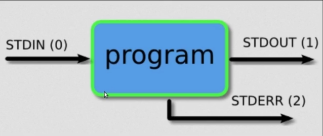

# Bash e Comandos Linux

O Bash (Bourne Again SHell) é o interpretador de comandos mais utilizado em sistemas Linux.  
Ele funciona como uma interface entre o usuário e o sistema operacional, permitindo executar comandos, automatizar tarefas, manipular arquivos, instalar programas e controlar processos.
Criando um terminal: 
https://www.youtube.com/watch?v=tiDVxNCxa1g

No Linux, praticamente tudo pode ser feito pelo terminal.

---

## Estrutura básica de um comando

A maioria dos comandos segue a estrutura:

```bash
comando [opções] [argumentos]
```
---

### Navegação entre diretórios
#### 1) Mostra o diretório atual.
PWD - Print working Directory
```bash
pwd
```

#### 2) Lista arquivos e pastas.
LS - List
```bash
ls
```

#### 3) Listagem detalhada:
Verifica as permissões
```bash
ls -l
```

#### 4) Mostrar arquivos ocultos:

```bash
ls -a
```

#### 5) Listar arquivos em ordem de criação:
```bash
# Crescente
ls -ltr

# Decrescente
ls -lts
```

#### 6) Muda de diretório.

**Entrar em uma pasta:**
CD - Change Directory
```bash
cd Documentos
```

**Voltar uma pasta:**
```bash
cd ..
```

**Ir para a home:**
```bash
cd ~
```

### Processos (ps - process status)
#### 1) Exibir processos em execução no terminal atual: 
```bash
ps
```

#### 2) Exibir todos os processos em execução no sistema:
```bash
ps -e

# OU

ps -A
```

#### 3) Exibir uma saída mais detalhada, incluindo informações como o ID do processo pai (PPID): 
```bash
ps -f
```

#### 4) Exibir todos os processos que pertencem ao usuário especificado:
```bash
ps -u pedro
```

#### 5) Exibir todos os processos do sistema, independente de qual terminal ou usuário os iniciou, mostrando informações detalhadas: 
```bash
ps aux
```
- a: exibir processo de todos os usuários
- u: exibir informações do usuário proprietário do processo
- x: mostra processos sem terminal associado.

#### 6) Exibir informações de um processo específico:
```bash
ps -p PID
```

#### Exibir informações detalhadas sobre os processos em formato de lista longa: 
```bash
ps -l
```


### Manipulação de arquivos e pastas
#### 1) Cria diretórios.
```bash
mkdir minha_pasta
```

#### 2) Criar múltiplas pastas:
```bash
mkdir pasta1 pasta2 pasta3
```

#### 3) touch
Cria arquivos vazios ou atualizar o horário de criação de um arquivo já existente.
```bash
touch arquivo.extensão
```

#### 4) Copia arquivos ou pastas.
**Copiar arquivo:**
```bash
cp origem.txt copia.txt
```

**Copiar diretório:**
```bash
cp -r pasta_origem pasta_destino
```

#### 5) Move ou renomeia arquivos.
**Renomear:**
```bash
mv antigo.txt novo.txt
```
Cuidado com esse comando, pois se renomearmos por um nome que já existe, vamos subescrevê-lo, assim o arquivo de nome original vai desaparecer e ficar apenas o que renomeamos. 

**Mover:**
```bash
mv arquivo.txt Documentos/
```

#### 6) Remove arquivos ou diretórios.
**Remover arquivo:**
RM - Remove
```bash
rm arquivo.txt
```
OBS: Não existe lixeira.

Se usarmos:
```bash
rm -i arquivos_id_*
```
Ao invés de apagar todos os arquivos que começam com arquivos_id_alguma coisa, a flag `-i` indica o iterativo, então o terminal ficará perguntando se quer remover os arquivos específicos. 

**Remover pasta:**
```bash
rm -r pasta
```

**ATENÇÃO:** arquivos removidos pelo terminal normalmente não vão para a lixeira.

### Mexendo com arquivos
Ver o conteúdo do arquivo:
```bash
cat file.txt
```

Ver as primeiras linhas de um arquivo:
```bash
head -nNUMERO arquivo
```

Ver as últimas linhas de um arquivo:
```bash
tail -nNUMERO arquivo
```
OBS: Se não especificar o número de linhas, será considerado 5. 

Contar linhas, palavras e caracteres/bytes em um arquivo: 
```bash
# Faz tudo:
wc arquivo

# Conta número de linhas
wc -l arquivo

# Conta o número de bytes
wc -c arquivo

# Conta o número de caracteres
wc -m arquivo

# Conta o número de palavras 
wc -w arquivo

# Mostra o comprimento da linha mais longa
wc -L arquivo
```

Ordenar a saída do arquivo:
```bash
sort arquivo
```

Verificar valores uma vez:
```bash
uniq arquivo
```

Comparar dois arquivos:
```bash
diff arquivo1 arquivo2
```

Busca arquivos e diretórios:
```bash
find . -name "*.py"
```

Busca palavras dentro de arquivos:
```bash
grep "main" arquivo.py
```
OBS: Grep é um programa para pesquisar um padrão.

Ignorar maiúsculas/minúsculas:
```bash
grep -i "erro" log.txt
```

### Redirecionamento de saída


Normalmente, a saída padrão é a tela, mas podemos mudar isso.

Subscrever em um arquivo: 
```bash
echo hello > file.txt
```
OBS: Isso vai subscrever tudo que estiver no arquivo file.txt

Escrever ao final de um arquivo (concatena no final):
```bash
echo alguma coisa >> file.txt
```
OBS: Se o arquivo não existir, ele será criado. 

**ATENÇÃO:** O comando de redirecionamento `> ou >>` na verdade possui um '1' omitido: `1> ou 1>>`, pois o '1' faz referência a saída padrão (STDOUT).
Para a saída de erro, utilizamos `2> ou 2>>`

Criar uma saída de erros
```bash
ls -l arquivo_nao_existe.txt 2>> log.out 
# log.out é um arquivo que será criado
```
OBS: Se tivermos usando o `1> ou 1>>`, como estamos usando a saída padrão, se houver erro, a saída de erro será lançada no terminal, por não estarmos redirecionando para nenhum arquivo. Por padrão, usamos log.out ou log_erro.out. 

Buraco negro do terminal
```bash
ls -ls alunos.txtxtx 2> /dev/null
# Redirecionando uma saída de erro para não aparecer em nenhum lugar.
```


### Arquivos de paginação
Uma foma melhor para ler aquivos no terminal
```bash
less arquivo_de_leitura
```
- /alguma coisa: pesquisa a palavra
- n: next -> próxima ocorrência
- N: ocorrência anterior
- enter: desce uma linha
- espaço: desce uma página

### Man (manual) Pages 
Gerar um manual do comando
```bash
# Exemplo
man ls
```

### Verificar o que um determinado comando faz
```bash
whatis comando
```

### Variáveis no Shell
#### Verificar as variáveis existentes:
```bash
env | less
```

#### Variáveis básicas:
```bash
echo $HOME
echo $USER
echo $PWD
echo $SHELL
echo $UID
```

Além disso, também podemos criar nossas próprias variáveis válidas apenas para a sessão do terminal. 
```bash
nome=pedro # Sem espaços
echo $nome
```
**OBS:** Cuidado com aspas duplas e aspas simples, pois a dupla retorna a string original:

```bash
pedro@pedro-Aspire-A515-54G:~$ nome="pedro      zenatte"
pedro@pedro-Aspire-A515-54G:~$ echo $nome
pedro zenatte
pedro@pedro-Aspire-A515-54G:~$ echo "$nome"
pedro      zenatte
```

Para desativar a variável:
```bash
unset nome_da_variavel
```

Nome do usuário e do computador:
```bash
pedro@pedro-Aspire-A515-54G:~$ whoami
pedro
pedro@pedro-Aspire-A515-54G:~$ uname
Linux
pedro@pedro-Aspire-A515-54G:~$ uname -a
Linux pedro-Aspire-A515-54G 7.0.0-15-generic #15-Ubuntu SMP PREEMPT_DYNAMIC Wed Apr 22 16:06:43 UTC 2026 x86_64 GNU/Linux
```

Atribuir um comando a uma variável (guardar a saída de um comando):
```bash
pedro@pedro-Aspire-A515-54G:~$ thing=`uname -a`
pedro@pedro-Aspire-A515-54G:~$ echo "$thing"
Linux pedro-Aspire-A515-54G 7.0.0-15-generic #15-Ubuntu SMP PREEMPT_DYNAMIC Wed Apr 22 16:06:43 UTC 2026 x86_64 GNU/Linux
```
OU
```bash
thing=$(uname -a)
echo "$thing"
```


### Permissões de arquivos
No Linux, arquivos possuem permissões de leitura, escrita e execução.

#### 1) Altera permissões.
**Dar permissão de execução:**
```bash
chmod +x script.sh
```

---

Ao fazer um script.sh, na primeira linha do script colocar shebang ou hashbang. Isso é uma linha especial usada no início de scripts em sistemas Unix que inidica ao SO qual interpretador usar para rodar o script. 

Exemplo:
```sh
#!/usr/bin/env bash

comandos
...
...
```

Dessa forma, estamos dizendo que o script deve ser executado usando o Bash, independentemente de qual versão do Bash ou do sistema esteja sendo usada.

---

MINUTO 1:22:45

### Histórico de Comandos
#### Ver histórico
```bash
history
```

### Arquivos Ocultos
Para criar um arquivo oculto, usamos:
```bash
# Um ponto antes do arquivo
touch .file.txt
```

Para listar esses arquivos:
```bash
ls -a
```

### Executar comandos em sequeência controlados: 
```bash
# Podemos executar em forma de pipeline 
comando1 | comando2 |comando3... # A saída de um é a entrada do outro
```

```bash
# Podemos executar um em seguida do outro
comando1 ; comando2 ; comando3....
```
Nesse caso, seram executados todos os comandos, mesmo se houver erro. 

```bash
# Executando os comandos um em seguida do outro se houver sucesso no anterior
comando1 && comando2
```

```bash
# O contrário agora
# Se o primeiro comando for executado com sucesso, não executo o segundo
comando1 || comando2
```

```bash
# Rodar comandos em outros diretórios sem sair do atual
(cd .. ; ls -l) # Perceba que está entre parênteses
```


### Aleatórios
#### Montar um pendrive sem dar trigger na regra: 
```bash
sudo systemctl start 
```

#### Verificar onde algo está localizado no sistema:
```bash
which python3
```

#### Identificar o tipo de comando ou se é um alias:
```bash
# Exemplo
type ls
```

#### Identificar o tipo de um arquivo:
Esse comando analisa o conteúdo, dizendo se o arquivo é um texto ASCII, uma imagem, um executável, um diretório, entre outros.
```bash
file algum_arquivo/diretório
```

#### Translate (tr):
Traduzir, deletar ou cumprir caracteres de entrada padrão
```bash
echo $PATH | tr ":" "\n"
```
Nesse caso, os dois pontos virarão '\n'. 

#### Fornecer informações sobre pacotes:
```bash
sudo dpkg -l
```


---

### PATH
O \$PATH é uma variável de ambiente no Linux que define os diretórios onde o sistema procura por executáveis. Quando você digita um comando no terminal, o sistema verifica o conteúdo do $PATH na ordem dos diretórios listados para encontrar o programa correspondente e executá-lo, facilitando o uso de comandos sem precisar especificar seu caminho completo.

Sendo assim, podemos criar comandos personalizados.

---

## Referência
https://www.youtube.com/watch?v=Sx9zG7wa4FA